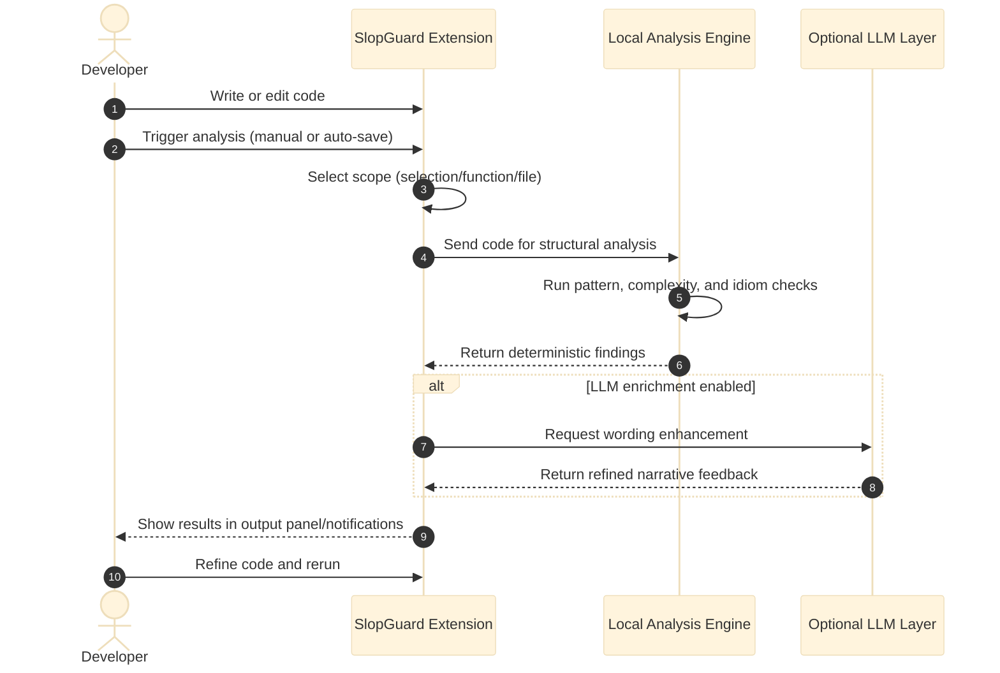

## SlopGuard

**SlopGuard is a “static AI reviewer” for VS Code-compatible editors (VS Code, Cursor, Antigravity) that catches sloppy patterns in your codebase before they ever reach a pull request.**

Instead of relying on probabilistic LLM reviewers for every change, SlopGuard gives teams a **fast, deterministic, local-first analysis engine** that flags low-quality patterns and algorithmic pitfalls directly in the editor as you work.

It is designed to complement (and in many cases replace) tools like Coderabbit-style AI review bots by:

- **Moving feedback earlier** (while coding, not after opening a PR).
- **Running locally and deterministically** via a Rust engine.
- **Codifying review standards** so teams get consistent feedback, not “vibes” per review.

**Extension releases:** see root [`CHANGELOG.md`](./CHANGELOG.md) and [`extension/README.md`](./extension/README.md) for Marketplace-facing notes. Latest published extension version: **0.0.4**.

---

Screenshots:


## Why engineering teams use SlopGuard

- **Shift-left code review**  
  Catch “junior patterns” (manual loops, redundant variables, deep nesting) as the code is being written, so PR reviewers can focus on design and correctness instead of stylistic cleanup.

- **Make senior review time count**  
  SlopGuard enforces repeatable, objective checks. Human reviewers spend less time pointing out `for`+`push` patterns and more time discussing architecture and trade-offs.

- **Deterministic, explainable results**  
  The Rust engine uses ASTs and heuristics, not opaque LLM guesses. The same code always produces the same findings, which is critical for teams that care about reproducibility.

- **Better onboarding and mentorship**  
  New engineers get **immediate, in-editor explanations** of common anti-patterns and algorithmic issues. You can treat the tool as a senior engineer that always has time to comment on structure and complexity.

- **Security and compliance friendly**  
  The core analysis engine runs **locally**. No code needs to leave your machine. An optional LLM layer can be turned on if you want narrative feedback, but it’s strictly opt-in and configured via your own endpoint.

---

## How SlopGuard compares to Coderabbit-style AI review bots

SlopGuard is **not** a cloud code-review SaaS. It focuses on **early, local, structural analysis**, and can sit alongside or in place of AI PR reviewers.

- **When you would reach for Coderabbit-like tools**
  - You want **natural-language commentary** on full pull requests.
  - You’re comfortable sending code to a hosted LLM service.
  - Feedback happens mostly *after* a PR is opened.

- **What SlopGuard does differently**

  - **Local-first, no API required**  
    - The Rust engine runs on your machine and inspects code via stdin/stdout.  
    - No API key or network is needed for core analysis.

  - **Deterministic checks vs stochastic reviews**  
    - Rules are implemented with tree-sitter AST + heuristics.  
    - The same diff gets the same feedback every time, which is ideal for teams building internal standards.

  - **Tight editor integration**  
    - Runs directly in VS Code-compatible editors via `SlopGuard: Analyze Selection` or automatically on save.  
    - Developers get feedback while typing or saving, before pushing branches.

  - **Team-aligned guardrails**  
    - Focuses on patterns many senior engineers nag about in review: manual iteration, unnecessary variables, deep nesting, repeated logic, and language-specific anti-patterns.
    - This makes it a natural “first-pass reviewer” that cleans up obvious issues so PR bots (or humans) can focus on higher-level concerns.

You can still wire up LLM-based review (including services like Coderabbit) on top of SlopGuard; in that model SlopGuard is the **structural safety net**, and AI review is an **optional narrative layer**.

---

## What SlopGuard detects today

**Supported languages (current):**

- TypeScript
- JavaScript
- Python
- Go
- Rust
- Ruby
- Java

**Core patterns detected:**

- **Manual iteration when a higher-level construct is available**
  - `for` loops plus `push`/`append` that could be expressed via `map` / `filter` / comprehensions / iterators.

- **Redundant variables**
  - e.g. `const x = compute(); return x;` → `return compute();`

- **Deep nesting and complex branches**
  - Excessive `{}` depth, nested conditionals and loops that can often be flattened or early-returned.

- **Repeated logic (heuristic)**
  - Sections of code that are structurally very similar within a function/file and are candidates for extraction.

- **Language-specific idioms:**
  - **JavaScript/TypeScript**: `for` + `push` meshes where `map`, `filter`, `reduce`, or `flatMap` are more idiomatic.
  - **Python**: `for i in range(len(items))` plus `append` when direct iteration / comprehensions are more idiomatic.
  - **Rust**: suspicious `clone()` overuse, particularly in loops and hot paths.

Every issue reported by the engine includes:

- A short **issue title** (e.g. “Redundant variable before return”).
- An **explanation** array with reasoning.
- A **confidence score**.
- Optional **suggestion** text.
- Optional **algorithm analysis** with time/space complexity and trade-off hints.

---

## How it fits into your workflow

### Manual “spot check” workflow

- **Use case**: You’re iterating on a function and want a quick structural review before committing.

1. Select any code in your editor **or** place your cursor inside a function.
2. Open the Command Palette and run **`SlopGuard: Analyze Selection`**.
3. SlopGuard:
   - Detects whether to analyze the selection, current function-like block, or full file (based on your settings).
   - Streams issues into the `SlopGuard` output channel.
   - Optionally shows a notification with the number of issues found.

This is the equivalent of asking a senior engineer: “Anything obviously sloppy here?” — but in <1 second and without waiting on a PR.

### Auto-on-save workflow

- **Use case**: You want a passive guardrail that runs every time you save, so small slop never ships.

1. Enable **`slopguard.autoAnalyzeOnSave`** in your editor settings.
2. Choose an **analysis scope**:
   - `auto` (default): prefer selection, then current function/block, then full file.
   - `selection`: only analyze the current selection.
   - `function`: analyze the current function-like scope around the cursor.
   - `file`: analyze the entire file.
3. (Optional) Turn on **`slopguard.showAutoNotifications`** if you want toast messages for auto runs.
4. As you type and save, SlopGuard:
   - Re-runs analysis for the chosen scope.
   - Updates the `SlopGuard` output panel with any issues.

This is especially powerful for teams adopting “lint clean” policies, but for structural quality rather than just style.

---

## Optional LLM enrichment (narrative layer)

The Rust engine already returns **human-readable explanations and algorithm analysis**. For teams that want more narrative feedback, SlopGuard can layer an **LLM enrichment step** on top.

- **Disabled by default** – you get full static analysis with **no API keys** or network calls.
- When enabled, the extension:
  - Sends the code + engine issues to an OpenAI-compatible chat completions endpoint.
  - Asks the LLM to refine explanations and algorithm commentary, keeping issue names stable.
  - Merges that back into the issues before rendering them.
- If the LLM call fails (network, auth, bad JSON), SlopGuard **silently falls back** to the raw Rust-engine results.

**Settings (all optional):**

- `slopguard.llm.enabled` – turn enrichment on/off.
- (API keys are read from env vars; no key inputs in settings are required.)

This lets teams choose their own LLM provider and compliance story while keeping the **core value (structural detection)** completely local and deterministic.

Note: As of the current MVP, users should NOT provide API keys in settings. The extension reads API credentials from environment variables instead.

Users only need to enable `slopguard.llm.enabled`. Configure one of the following env vars for LLM access:

- `OPENROUTER_API_KEY` (uses OpenRouter)
- `OPENAI_API_KEY` (uses OpenAI)
- `SLOP_GUARD_LLM_API_KEY` (uses `SLOP_GUARD_LLM_ENDPOINT` if set, otherwise OpenRouter)

Optional:
- `SLOP_GUARD_LLM_MODEL` (override the default model id)

---

## Getting started locally

### Prerequisites

- **Node.js 18+**
- **npm 9+**
- **Rust toolchain** (`cargo`, `rustc`)
- A VS Code-compatible editor (VS Code, Cursor, Antigravity)

### 1) Build the Rust engine

```bash
cd engine
cargo build
```

This produces:

- macOS/Linux debug: `engine/target/debug/slopguard-engine`
- Windows debug: `engine/target/debug/slopguard-engine.exe`

You can also build a release binary:

```bash
cargo build --release
```

### 2) Install extension dependencies

```bash
cd extension
npm install
npm run compile
```

### 3) Run the extension in a Development Host

1. Open the `extension/` folder in your editor.
2. Press **F5** (Run Extension).
3. A new Extension Development Host window will appear.
4. In that window:
   - Open some code.
   - Run `SlopGuard: Analyze Selection` from the Command Palette.

### 4) Configure engine resolution

By default, the extension tries to **auto-detect** the engine binary:

- If `slopguard.enginePath` is set and exists, it uses that.
- Otherwise it looks for `slopguard-engine` under common `engine/target/{debug,release}` paths relative to your workspace.
- If it finds a `Cargo.toml` for the engine, it falls back to:
  - `cargo run --quiet --manifest-path <engine/Cargo.toml>`

You can override the engine location explicitly:

- **Setting**: `slopguard.enginePath`
- **Example**:
  - `/absolute/path/to/slopguard/engine/target/debug/slopguard-engine`

If nothing can be resolved, the extension will show:

- **“SlopGuard: Engine not found. Build `engine` first or set slopguard.enginePath.”**

---

## Example: from junior-ish loop to senior-ish code

File: `examples/sample.js`

```js
function transform(items) {
  const result = [];
  for (let i = 0; i < items.length; i++) {
    if (items[i].active) {
      result.push(items[i].name.toUpperCase());
    }
  }

  const output = result;
  return output;
}
```

Running `SlopGuard: Analyze Selection` on this function will typically surface issues like:

- **Manual iteration detected** – suggests a more idiomatic `filter` + `map` pipeline.
- **Redundant variable before return** – suggests returning `result` directly.

That’s exactly the kind of feedback many teams currently rely on senior reviewers (or AI PR bots) to provide. With SlopGuard, engineers get it **as they write the code**, not during a later review.

---

## Architecture overview



SlopGuard runs as a loop in your editor: you write code, analysis is triggered, structural checks run locally, and feedback appears immediately so you can improve before review.
If enabled, LLM enrichment adjusts only how feedback is phrased; the core structural detection remains local and deterministic.

---

## Roadmap

- **Deeper AST coverage**
  - Expand tree-sitter support across more languages and patterns.
  - Gradually replace heuristics with robust AST-backed rules where possible.

- **Team-level configuration**
  - Tunable “strictness levels” and rule sets.
  - Project-level configs so everyone gets the same structural feedback.

- **Richer editor surfaces**
  - Inline diagnostics and code actions in addition to the output panel.
  - Quick-fix suggestions for common patterns (e.g. auto-convert redundant variable).

If your team is already using Coderabbit-style reviewers and wants to **push more feedback into the IDE**, SlopGuard is designed to be that missing structural layer. It standardizes what “good shape” looks like, so humans and LLMs can focus on the parts of review that truly need judgment.
