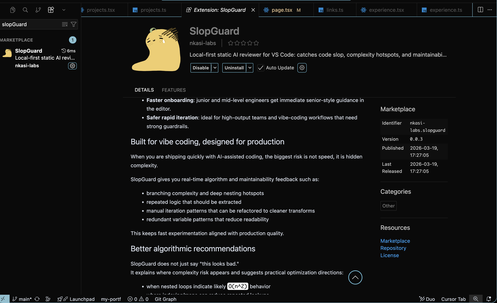
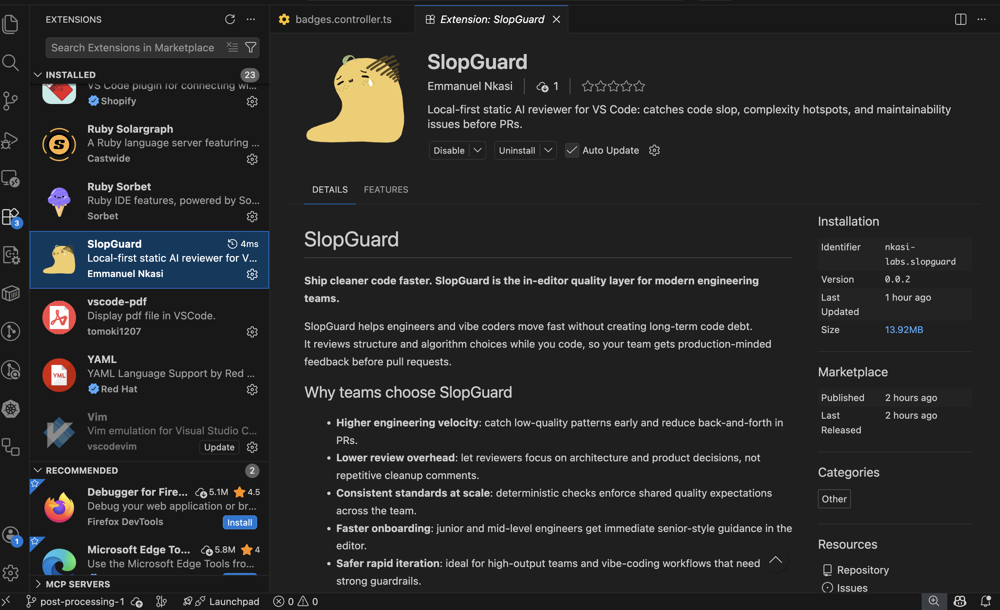

# SlopGuard

**Ship cleaner code faster. SlopGuard is the in-editor quality layer for modern engineering teams.**

**Current extension version: 0.0.5**

### Included in this release

- **Persistent native engine path** now attempts long-lived `--serve` mode for lower per-run overhead.
- **Safe fallback behavior**: if persistent mode fails, SlopGuard falls back to one-shot native execution and avoids repeated timeout penalties.
- **Incremental AST support** is wired via `documentKey` request context.
- **CFG semantic analyzer (v0)** is active with first rule:
  - `Blocking call in async context` (`issueType: async-blocking`)
  - Supported on TypeScript, JavaScript, Python, Go, Rust, Ruby, Java.
- **Engine internals refactored** into modular AST/CFG folders for maintainability and faster iteration.
- **Automated integration tests** added for CFG async-blocking behavior (`engine/tests/cfg_async_blocking.rs`).

### What’s new in 0.0.5

- **Complexity & approach scorecards** in the output panel (current vs suggested complexity, trade-off headlines, maintainability framing).
- **Symbol impact**: see **reference counts per file** via your editor’s language service; optional **peek references** after each run.
- **Quick Actions** + **status bar** (`SlopGuard`) + **editor title** entry — one place to analyze, open output, settings, walkthrough, or toggle idle analysis.
- **Run header** on each analysis: scope, **native vs WASM** engine, LLM on/off.
- **Safer defaults for huge files** (`slopguard.maxAnalyzeLines`) and **long issue lists** (`slopguard.maxIssuesDetailed`).
- **Get Started walkthrough** + optional **first-run hint** (`slopguard.showFirstRunHint`).

SlopGuard helps engineers and vibe coders move fast without creating long-term code debt.  
It reviews structure and algorithm choices while you code, so your team gets production-minded feedback before pull requests.

## Why teams choose SlopGuard

- **Higher engineering velocity**: catch low-quality patterns early and reduce back-and-forth in PRs.
- **Lower review overhead**: let reviewers focus on architecture and product decisions, not repetitive cleanup comments.
- **Consistent standards at scale**: deterministic checks enforce shared quality expectations across the team.
- **Faster onboarding**: junior and mid-level engineers get immediate senior-style guidance in the editor.
- **Safer rapid iteration**: ideal for high-output teams and vibe-coding workflows that need strong guardrails.

## Built for vibe coding, designed for production

When you are shipping quickly with AI-assisted coding, the biggest risk is not speed, it is hidden complexity.

SlopGuard gives you real-time algorithm and maintainability feedback such as:

- branching complexity and deep nesting hotspots
- repeated logic that should be extracted
- manual iteration patterns that can be refactored to cleaner transforms
- redundant variable patterns that reduce readability

This keeps fast experimentation aligned with production quality.

## Better algorithmic recommendations

SlopGuard does not just say "this looks bad."  
It explains where complexity risk appears and suggests practical optimization directions:

- when nested loops indicate likely `O(n^2)` behavior
- where indexing/maps can reduce repeated lookups
- where trade-offs improve runtime at acceptable memory cost

For algorithm-heavy findings, the **SlopGuard** output shows a **complexity scorecard**: **current vs suggested** time/space, a **trade-off headline** (memory vs speed, clarity vs performance), and deeper trade-off notes.

Your team gets recommendations that are actionable, not generic.

## Quick start (how to use the editor)

### 1) Select code (or rely on auto-detect)

- Manual: select a code section in the editor.
- Auto-detect: if nothing is selected and your scope is `auto`, SlopGuard tries to analyze the current function/block around your cursor.

### 2) Run SlopGuard

Fastest paths:

- **Status bar**: click **SlopGuard** (bottom right) → **Quick Actions** (analyze, symbol impact, output, settings, walkthrough).
- **Editor title bar**: **SlopGuard** icon (when a file tab is open).
- **Command Palette**: `SlopGuard: Analyze Selection` or `SlopGuard: Quick Actions`
- **Shortcut**: `Cmd+Alt+A` (macOS) / `Ctrl+Alt+A` (Windows/Linux)

After analysis, the output panel shows a short **run header** (scope, engine: native vs WASM, LLM on/off). Evidence lines include **clickable file paths** where the editor supports it.

**Get Started**: Command Palette → **Welcome: Open Walkthrough…** → *Get started with SlopGuard* (or use Quick Actions → *Open Get Started walkthrough*).

### Symbol impact (workspace references)

Before you change a function or export, see **where it is used**:

1. Put the cursor on the **symbol name** (function, variable, class, etc.).
2. Run **`SlopGuard: Show Symbol Impact (References)`** (also in the editor right-click menu).

SlopGuard asks the **language service** (same data as “Find All References”) for reference locations, then lists **per-file counts** in the output panel. **Install the usual language extension** for your stack (e.g. built-in TS/JS, Pylance, rust-analyzer) — SlopGuard does not ship language servers. This is **not** a full proof of breakage; it is a fast **call-site map** before you commit.

### 3) Read results

SlopGuard writes findings to the `SlopGuard` output panel.
Each issue includes a title, explanation, confidence, and (when available) algorithm/trade-off analysis.

Images:

<!-- Optional demo video:
<video controls width="100%" src="./media/selectionrec.mov"></video>
<video controls width="100%" src="./media/file%20analysicrec.mov"></video> -->

## Auto-analysis on save (optional)

Auto-analysis is disabled by default.

To enable it:
1. Set `slopguard.autoAnalyzeOnSave` to `true`
2. Choose `slopguard.analysisScope`:
   - `auto`: selection -> current function/block -> file
   - `selection`: only selection
   - `function`: current function/block
   - `file`: whole file

Optional: if you want toast notifications, set `slopguard.showAutoNotifications` to `true`.

### More settings (0.0.4+)

| Setting | Default | Purpose |
|--------|---------|---------|
| `slopguard.maxAnalyzeLines` | `12000` | Cap lines sent to the engine for very large files. |
| `slopguard.maxIssuesDetailed` | `30` | Full detail for the first N issues; rest as one-line summaries. |
| `slopguard.showFirstRunHint` | `true` | One-time tip after install (Quick Actions + shortcuts). |

## Engine resolution (install and use)

**No Rust install required** for normal Marketplace use. SlopGuard picks an engine in this order:

1. **`slopguard.enginePath`** — if set and the file exists.
2. **Bundled native binary** — `runtime/<platform>/slopguard-engine` (or `.exe`) shipped with the extension for your OS/arch when present.
3. **Workspace dev builds** — `engine/target/debug|release/slopguard-engine` under the workspace (or one folder up).
4. **`cargo run`** — if `engine/Cargo.toml` exists in the workspace (developer workflow).
5. **WASM fallback** — `runtime/wasm/slopguard_engine.wasm` for platforms without a native binary. *Uses pattern + complexity analyzers; AST-heavy rules need the native engine.*

LLM enrichment is still **optional** and **off by default** (see below).

## Optional LLM narrative layer (disabled by default)

Core analysis is local and deterministic.
LLM enrichment refines explanations and algorithm commentary, but you must explicitly enable it.

Enable:
- `slopguard.llm.enabled = true`

LLM credentials are read from environment variables (not from editor settings).
Provide one:
- `OPENROUTER_API_KEY` (OpenRouter)
- `OPENAI_API_KEY` (OpenAI)
- `SLOP_GUARD_LLM_API_KEY` (+ optional `SLOP_GUARD_LLM_ENDPOINT`)

If the LLM call fails, SlopGuard falls back to raw Rust-engine results.

## Ideal for teams that care about outcomes

Use SlopGuard when you want to:

- improve code quality without slowing delivery
- reduce PR noise and reviewer fatigue
- scale engineering standards across fast-moving teams
- keep vibe coding creative while staying technically disciplined

Open any project and run **SlopGuard: Analyze Selection** to see immediate value.
